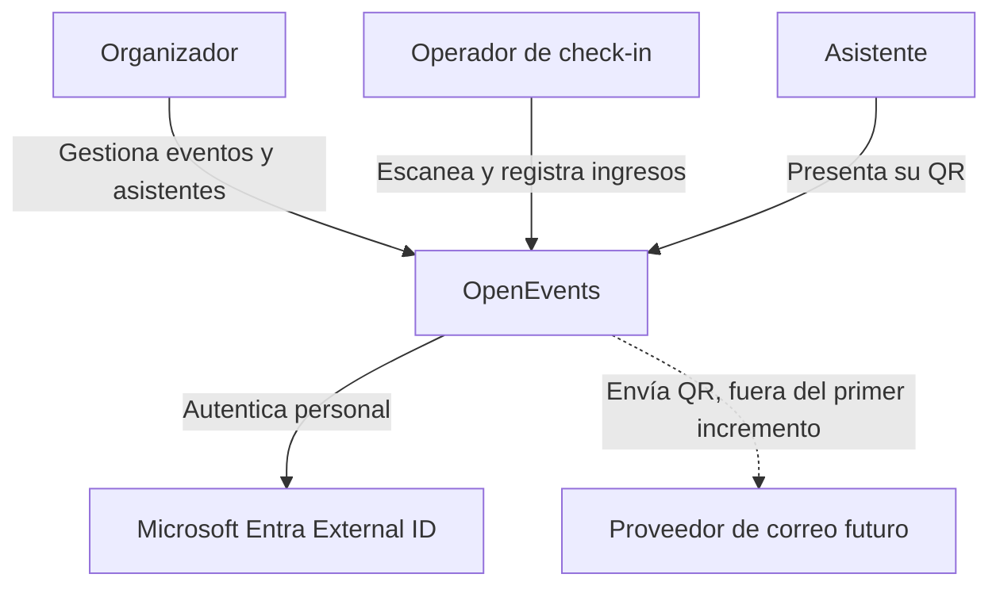
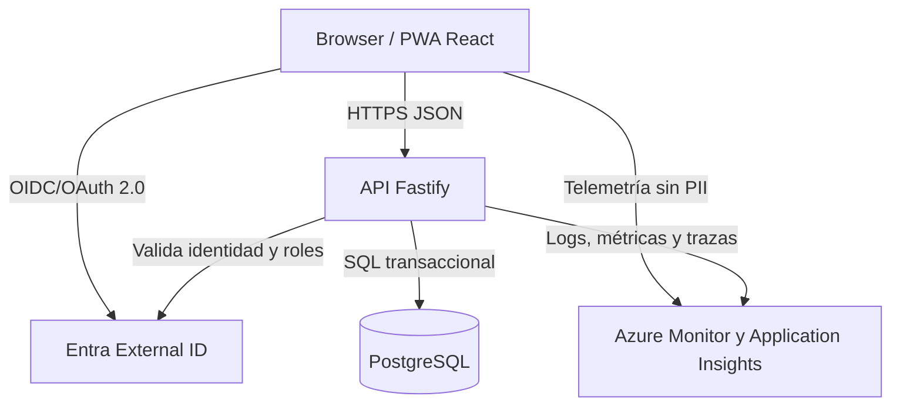
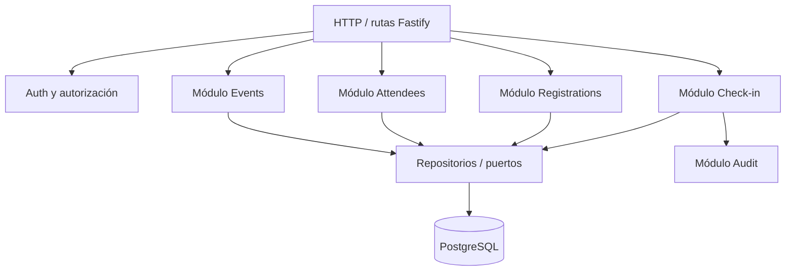
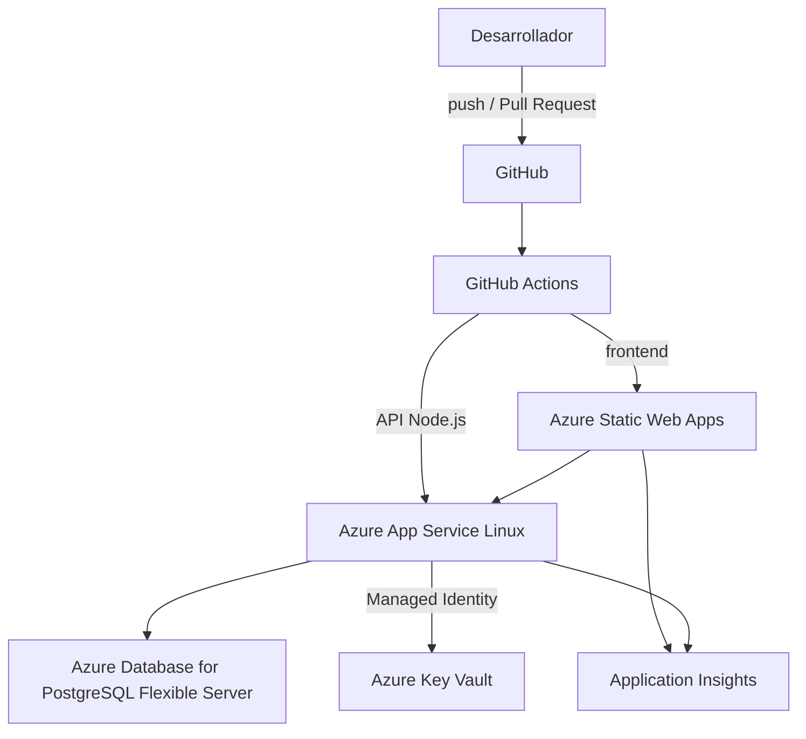
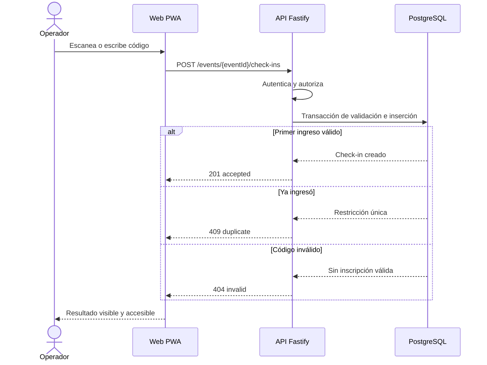

# Arquitectura inicial de OpenEvents

Estado: **Propuesta aceptada como baseline v0.1**  
Estilo: **monolito modular en monorepo**

## 1. Principios

1. Comenzar simple y permitir evolución.
2. Separar interfaz, dominio, aplicación e infraestructura.
3. La API es la autoridad de las reglas del negocio.
4. PostgreSQL es la fuente de verdad; la interfaz no calcula estados oficiales.
5. Seguridad, pruebas, observabilidad y automatización son parte del producto.
6. No adoptar microservicios hasta que existan límites y necesidades operativas demostradas.
7. Todo despliegue cloud debe ser reproducible mediante infraestructura como código.

## 2. Contexto del sistema



## 3. Contenedores lógicos



## 4. Componentes del monolito modular



Cada módulo puede contener:

```text
module/
  domain/          entidades y reglas puras
  application/     casos de uso
  infrastructure/  repositorios, adaptadores y persistencia
  http/            rutas, esquemas y mapeo de respuestas
```

La separación puede introducirse gradualmente; no es necesario mover todo el spike en un solo cambio.

## 5. Despliegue objetivo del MVP



### Justificación

- **Azure Static Web Apps:** encaja con una SPA React/Vite, integra GitHub y crea ambientes de vista previa por Pull Request.
- **Azure App Service Linux:** ejecuta Node.js sin administrar servidores y permite iniciar con menor complejidad que Kubernetes.
- **PostgreSQL Flexible Server:** base relacional administrada con respaldo y opciones de red/alta disponibilidad.
- **Key Vault:** centraliza secretos y certificados; la API accede mediante identidad administrada.
- **Application Insights:** centraliza trazas, dependencias, excepciones y métricas.
- **GitHub Actions con OIDC:** usa tokens de corta duración y evita una credencial Azure permanente en GitHub.

## 6. Flujo del check-in



## 7. Control de concurrencia

La prevención de duplicados no debe depender de consultar y luego insertar como operaciones independientes. Dos dispositivos podrían leer “sin ingreso” al mismo tiempo.

La base de datos debe imponer una restricción única sobre la inscripción cuando la política sea un único ingreso:

```sql
UNIQUE (registration_id)
```

La API intenta insertar dentro de una transacción. Si PostgreSQL rechaza el segundo intento por la restricción, la API lo traduce a `409 duplicate`. La base de datos, y no la memoria del proceso, garantiza la integridad.

## 8. Seguridad

### Identidad y permisos

- autenticación OIDC con Microsoft Entra External ID para personal externo;
- roles de aplicación: `admin`, `organizer`, `checkin_operator`;
- autorización en la API para cada operación;
- acceso denegado por defecto;
- mínimo privilegio en Azure y GitHub.

### Datos

- QR con token aleatorio opaco, no con correo, DNI o nombre;
- hash del token en base de datos si el modelo de amenaza lo requiere;
- TLS en tránsito y cifrado administrado en reposo;
- secretos fuera del repositorio;
- logs sin códigos completos ni PII innecesaria;
- política de retención y eliminación antes del piloto.

### Entrega

- protección de `main`;
- Pull Request obligatorio;
- CI con lint, typecheck, test y build;
- análisis de dependencias y secretos;
- despliegue con OIDC y ambientes protegidos;
- aprobación manual para producción inicialmente.

## 9. Observabilidad

Cada solicitud tendrá un `correlationId`. La API generará logs estructurados con:

- timestamp UTC;
- nivel;
- nombre de operación;
- resultado;
- duración;
- identificadores internos necesarios;
- correlation ID.

Métricas iniciales:

- cantidad de check-ins aceptados, duplicados e inválidos;
- latencia p50/p95/p99;
- errores HTTP 5xx;
- disponibilidad del endpoint de salud;
- conexiones y errores de PostgreSQL.

## 10. Ambientes

| Ambiente | Propósito | Datos |
|---|---|---|
| Local | Desarrollo y pruebas rápidas | Sintéticos |
| Development | Integración continua y demos internas | Sintéticos |
| Production | Piloto/evento | Reales, mínimos y controlados |

No se copiarán datos personales de producción a desarrollo.

## 11. Evolución prevista

1. Spike actual en memoria.
2. Persistencia PostgreSQL y módulos básicos.
3. Autenticación y autorización.
4. Despliegue Azure con IaC y CI/CD.
5. PWA y escaneo por cámara.
6. Observabilidad y piloto.
7. Evaluación posterior de offline, sesiones, sponsors o servicios separados.

## 12. Referencias oficiales

- [Azure Static Web Apps](https://learn.microsoft.com/azure/static-web-apps/overview)
- [Azure App Service](https://learn.microsoft.com/azure/app-service/overview)
- [Despliegue de App Service con GitHub Actions](https://learn.microsoft.com/azure/app-service/deploy-github-actions)
- [Azure Database for PostgreSQL](https://learn.microsoft.com/azure/postgresql/)
- [Microsoft Entra External ID](https://learn.microsoft.com/entra/external-id/)
- [Application Insights](https://learn.microsoft.com/azure/azure-monitor/app/app-insights-overview)

