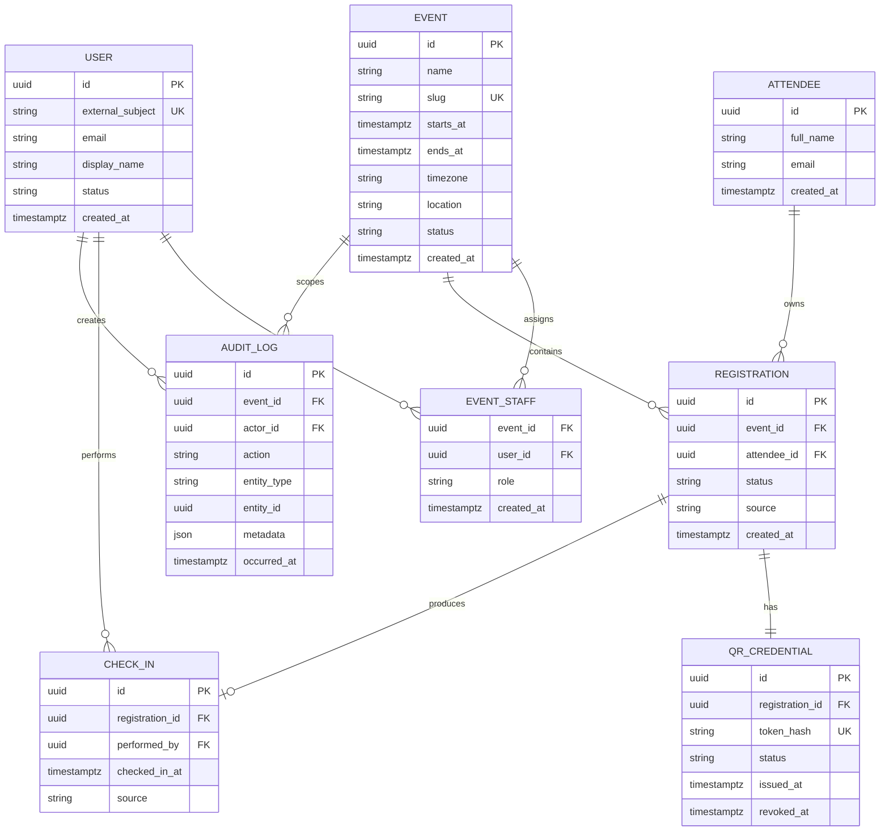

# Modelo de datos inicial

## 1. Diagrama lógico

## 2. Restricciones esenciales

| Restricción | Propósito |
|---|---|
| `UNIQUE(event_id, attendee_id)` en `registration` | Evitar doble inscripción accidental al mismo evento |
| `UNIQUE(registration_id)` en `qr_credential` | Un QR activo base por inscripción |
| `UNIQUE(token_hash)` en `qr_credential` | Evitar credenciales repetidas |
| `UNIQUE(registration_id)` en `check_in` | Garantizar un solo ingreso en el MVP |
| `PRIMARY KEY(event_id, user_id)` en `event_staff` | Evitar asignaciones duplicadas |
| Fechas en `timestamptz` y UTC | Consistencia entre zonas horarias |

## 3. Decisiones

- `attendee` representa a la persona; `registration` representa su participación en un evento.
- El QR apunta a la inscripción, no directamente a la persona.
- Se guarda el hash del token, no necesariamente el token en claro.
- El check-in es una entidad separada para conservar trazabilidad.
- `audit_log` no reemplaza los logs técnicos; registra eventos de negocio sensibles.
- Las estadísticas se calculan desde `registration` y `check_in`; no son contadores manuales.

## 4. Estados iniciales

| Entidad | Estados |
|---|---|
| Event | `draft`, `active`, `closed`, `cancelled` |
| User | `active`, `disabled` |
| Registration | `confirmed`, `cancelled` |
| QR Credential | `active`, `revoked`, `expired` |

## 5. Migraciones

El esquema se administrará mediante Drizzle ORM, Drizzle Kit y migraciones SQL versionadas. La decisión, las alternativas y la estrategia de aplicación se documentan en [ADR-004](../adr/ADR-004-orm-y-migraciones.md).

