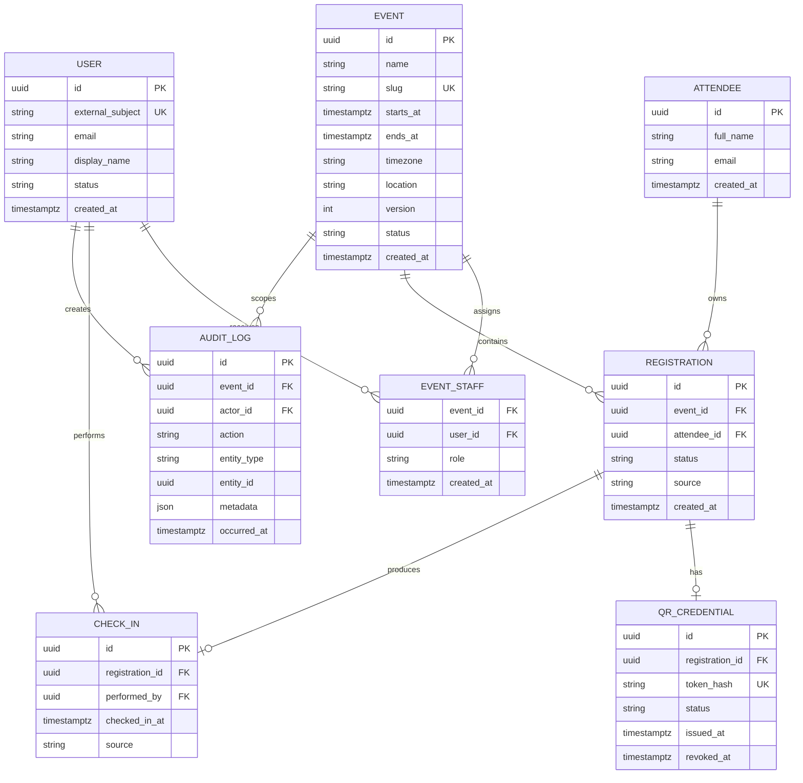

# Modelo de datos inicial

## 1. Diagrama lógico

## 2. Restricciones esenciales

| Restricción | Propósito |
|---|---|
| `UNIQUE(event_id, attendee_id)` en `registration` | Evitar doble inscripción accidental al mismo evento |
| `UNIQUE(registration_id)` en `qr_credential` | Como máximo una credencial por inscripción, independientemente de su estado |
| `UNIQUE(token_hash)` en `qr_credential` | Evitar credenciales repetidas |
| `UNIQUE(registration_id)` en `check_in` | Garantizar un solo ingreso en el MVP |
| `PRIMARY KEY(event_id, user_id)` en `event_staff` | Evitar asignaciones duplicadas |
| `event.version` integer NOT NULL DEFAULT 1 y CHECK > 0 | Versión persistida para detectar ediciones desactualizadas |
| Fechas en `timestamptz` y UTC | Consistencia entre zonas horarias |

## 3. Decisiones

- `attendee` representa a la persona; `registration` representa su participación en un evento.
- El QR apunta a la inscripción, no directamente a la persona.
- Se guarda el hash del token, no necesariamente el token en claro.
- El check-in es una entidad separada para conservar trazabilidad.
- `audit_log` no reemplaza los logs técnicos; registra eventos de negocio sensibles.
- Las estadísticas se calculan desde `registration` y `check_in`; no son contadores manuales.

## 4. Estados iniciales

| Entidad | Estados |
|---|---|
| Event | `draft`, `active`, `closed`, `cancelled` |
| User | `active`, `disabled` |
| Registration | `confirmed`, `cancelled` |
| QR Credential | `active`, `revoked`, `expired` |

## 5. Migraciones

El esquema se administrará mediante Drizzle ORM, Drizzle Kit y migraciones SQL versionadas. La decisión, las alternativas y la estrategia de aplicación se documentan en [ADR-004](../adr/ADR-004-orm-y-migraciones.md).

## 6. Decisiones de implementación inicial — OE-007

### Identificadores y campos obligatorios

- Las tablas con columna `id` utilizan UUID generados por PostgreSQL mediante `gen_random_uuid()`.
- `event_staff` utiliza la clave primaria compuesta `(event_id, user_id)`.
- Admiten `NULL`: `qr_credential.revoked_at` y, desde OE-01-002B, `user.email` y `user.display_name`. Los demás campos declarados siguen siendo obligatorios.
- `NOT NULL` impide valores nulos; no sustituye la validación de textos vacíos, correos ni otros formatos en la aplicación.
- El correo del asistente no tiene restricción única. La identidad del asistente se representa mediante su UUID.

### Estados y valores predeterminados

- Los estados de usuario, evento, inscripción y credencial QR utilizan tipos ENUM de PostgreSQL.
- Los valores iniciales son `active` para usuarios, `draft` para eventos, `confirmed` para inscripciones y `active` para credenciales QR.
- Los campos de creación, emisión, check-in y auditoría utilizan `now()` como valor predeterminado.
- `audit_log.metadata` utiliza JSONB con un objeto vacío como valor predeterminado.
- `role`, `source`, `action` y `entity_type` permanecen como texto; sus catálogos y validaciones se definirán con las historias correspondientes.

### Fechas

- Las fechas se almacenan como `timestamptz`.
- `event.timezone` conserva el nombre de la zona horaria del evento; `timestamptz` representa el instante, pero no conserva ese nombre.
- La restricción `event_dates_check` exige que `ends_at` sea posterior a `starts_at`.
- La aplicación deberá validar el nombre de la zona horaria y presentar las fechas según corresponda.

### Relaciones y borrado

- Las claves foráneas utilizan `ON DELETE RESTRICT` para impedir la eliminación de registros que todavía tienen referencias.
- No se configuraron borrados en cascada.
- Las claves foráneas comprueban existencia e integridad referencial; no implementan autorización.
- La API deberá comprobar que el operador esté autorizado para el evento y que el evento, la inscripción y el QR permitan el check-in.

### Credenciales QR

- Una inscripción puede tener cero o una fila en `qr_credential`.
- La unicidad de `registration_id` se aplica a todos los estados, no solamente a `active`.
- Con este esquema no se conservan varias filas históricas de credenciales para una misma inscripción.
- Si se requiere ese historial, deberá revisarse explícitamente el modelo y añadirse una migración.
- La generación, el hash y la validación del token se implementarán en las historias de QR.

### Auditoría

- Cada registro de auditoría requiere un evento y un usuario actor existentes.
- `entity_id` no tiene clave foránea porque puede identificar entidades de distintas tablas.
- La estructura y el contenido permitido de `metadata` deberán validarse en la aplicación.
- Las acciones automáticas sin usuario requerirán una decisión posterior sobre cómo representar al actor.

### Alcance de las pruebas

- Las pruebas de integración verifican duplicados de inscripción, check-in, asignación de personal y credenciales QR.
- También comprueban referencias inexistentes, borrado restringido, fechas inválidas y un estado de evento no permitido.
- Cada prueba revierte su transacción para descartar sus datos.
- La prueba de solicitudes simultáneas y la traducción de errores a `accepted`, `duplicate` o `invalid` corresponden a la implementación del check-in persistido.
## 7. Identidad y asignación — OE-01-002B

La migración `0001_absent_tigra.sql` elimina únicamente NOT NULL de `user.email` y `user.display_name`; conserva las filas y restricciones restantes. El historial y snapshot de Drizzle se versionan con el SQL.

La API identifica al usuario mediante `entra:<tenantId>:<objectId>` en `external_subject`, normalizado a minúsculas. Los datos de perfil ausentes quedan nulos; no se inventan ni se usan para autorización. La operación reutiliza identidades existentes y rechaza usuarios deshabilitados.

La creación HTTP inserta evento y `event_staff` con rol `organizer` en una transacción, junto con el usuario si es nuevo. Una asignación fallida no deja el evento guardado. Las solicitudes concurrentes reutilizan la identidad y la unicidad de slug conserva un único ganador.

No se asignan automáticamente eventos anteriores ni se convierten identidades antiguas de otros formatos. Su asociación exige una revisión explícita. Consulta [autenticación](authentication.md) para el alcance y las limitaciones.

## Versión de eventos — OE-02-002C

La migración `0002_brief_jocasta.sql` añade `event.version` con valor inicial 1 para eventos existentes y nuevos, sin eliminar registros. Se versionan SQL, snapshot 0002 y journal juntos. Aplicar la migración antes de ejecutar código que seleccione la nueva columna.

Cada PATCH aceptado incrementa version en uno dentro de la misma transacción que los datos. Version no representa fecha, estado, identidad ni historial de auditoría. No hay trigger que incremente la versión ante SQL directo: los futuros escritores deben participar explícitamente en este protocolo. Se reservan valores de entrada hasta 2147483646 para que el incremento quepa en integer; alcanzar el límite requerirá evolución del esquema.
