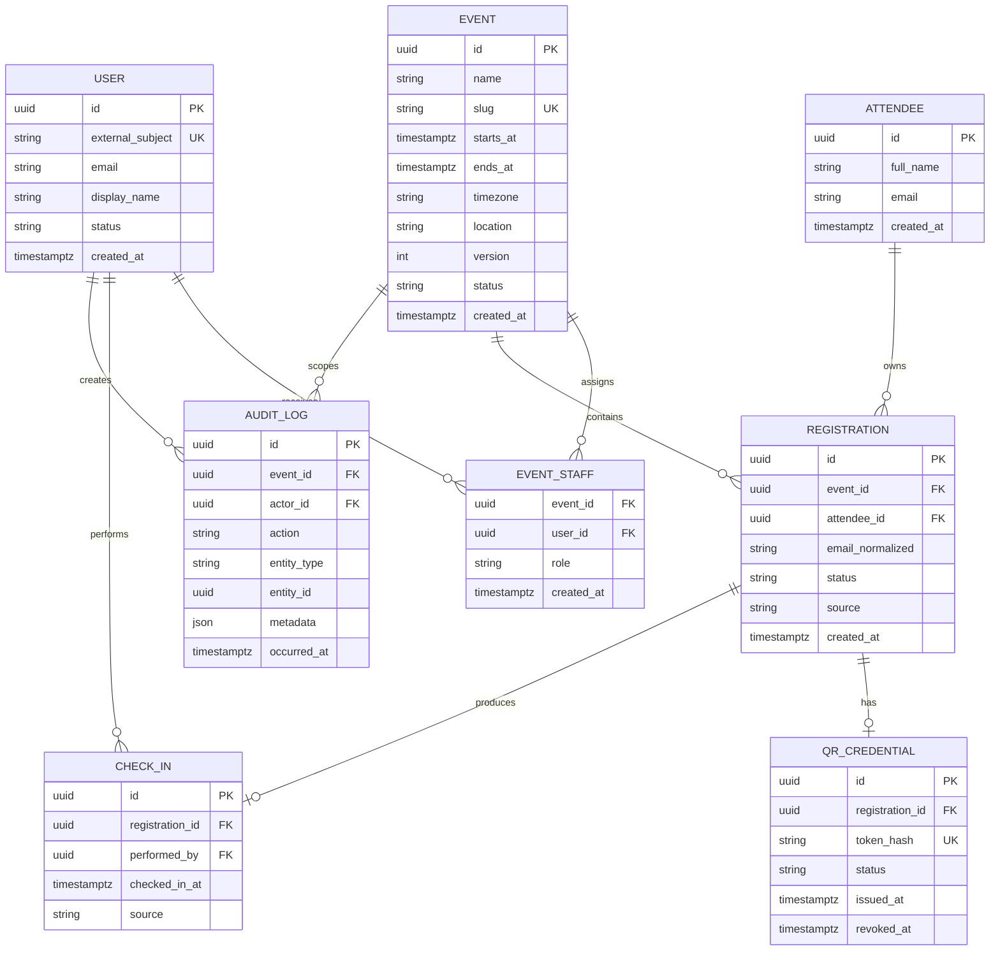

# Modelo de datos inicial

## 1. Diagrama lógico

## 2. Restricciones esenciales

| Restricción | Propósito |
|---|---|
| `UNIQUE(event_id, email_normalized)` en `registration` | Impedir duplicados de correo dentro de cada evento, incluidos cancelados |
| `UNIQUE(event_id, attendee_id)` en `registration` | Evitar doble inscripción accidental al mismo evento |
| `UNIQUE(registration_id)` en `qr_credential` | Como máximo una credencial por inscripción, independientemente de su estado |
| `UNIQUE(token_hash)` en `qr_credential` | Evitar credenciales repetidas |
| `UNIQUE(registration_id)` en `check_in` | Garantizar un solo ingreso en el MVP |
| `PRIMARY KEY(event_id, user_id)` en `event_staff` | Evitar asignaciones duplicadas |
| `event.version` integer NOT NULL DEFAULT 1 y CHECK > 0 | Versión persistida para detectar ediciones desactualizadas |
| Fechas en `timestamptz` y UTC | Consistencia entre zonas horarias |

## 3. Decisiones

- `attendee` representa a la persona; `registration` representa su participación en un evento.
- El QR apunta a la inscripción, no directamente a la persona.
- Se guarda el hash del token, no necesariamente el token en claro.
- El check-in es una entidad separada para conservar trazabilidad.
- `audit_log` no reemplaza los logs técnicos; registra eventos de negocio sensibles.
- Las estadísticas se calculan desde `registration` y `check_in`; no son contadores manuales.

## 4. Estados iniciales

| Entidad | Estados |
|---|---|
| Event | `draft`, `active`, `closed`, `cancelled` |
| User | `active`, `disabled` |
| Registration | `confirmed`, `cancelled` |
| QR Credential | `active`, `revoked`, `expired` |

## 5. Migraciones

El esquema se administrará mediante Drizzle ORM, Drizzle Kit y migraciones SQL versionadas. La decisión, las alternativas y la estrategia de aplicación se documentan en [ADR-004](../adr/ADR-004-orm-y-migraciones.md).

## 6. Decisiones de implementación inicial — OE-007

### Identificadores y campos obligatorios

- Las tablas con columna `id` utilizan UUID generados por PostgreSQL mediante `gen_random_uuid()`.
- `event_staff` utiliza la clave primaria compuesta `(event_id, user_id)`.
- Admiten `NULL`: `qr_credential.revoked_at` y, desde OE-01-002B, `user.email` y `user.display_name`. Los demás campos declarados siguen siendo obligatorios.
- `NOT NULL` impide valores nulos; no sustituye la validación de textos vacíos, correos ni otros formatos en la aplicación.
- El correo del asistente no tiene restricción única. La identidad del asistente se representa mediante su UUID.

### Estados y valores predeterminados

- Los estados de usuario, evento, inscripción y credencial QR utilizan tipos ENUM de PostgreSQL.
- Los valores iniciales son `active` para usuarios, `draft` para eventos, `confirmed` para inscripciones y `active` para credenciales QR.
- Los campos de creación, emisión, check-in y auditoría utilizan `now()` como valor predeterminado.
- `audit_log.metadata` utiliza JSONB con un objeto vacío como valor predeterminado.
- `role`, `source`, `action` y `entity_type` permanecen como texto; sus catálogos y validaciones se definirán con las historias correspondientes.

### Fechas

- Las fechas se almacenan como `timestamptz`.
- `event.timezone` conserva el nombre de la zona horaria del evento; `timestamptz` representa el instante, pero no conserva ese nombre.
- La restricción `event_dates_check` exige que `ends_at` sea posterior a `starts_at`.
- La aplicación deberá validar el nombre de la zona horaria y presentar las fechas según corresponda.

### Relaciones y borrado

- Las claves foráneas utilizan `ON DELETE RESTRICT` para impedir la eliminación de registros que todavía tienen referencias.
- No se configuraron borrados en cascada.
- Las claves foráneas comprueban existencia e integridad referencial; no implementan autorización.
- La API deberá comprobar que el operador esté autorizado para el evento y que el evento, la inscripción y el QR permitan el check-in.

### Credenciales QR

- Una inscripción puede tener cero o una fila en `qr_credential`.
- La unicidad de `registration_id` se aplica a todos los estados, no solamente a `active`.
- Con este esquema no se conservan varias filas históricas de credenciales para una misma inscripción.
- Si se requiere ese historial, deberá revisarse explícitamente el modelo y añadirse una migración.
- La generación y persistencia del hash se implementan internamente en #63; la validación del token y la representación QR permanecen pendientes.

### Auditoría

- Cada registro de auditoría requiere un evento y un usuario actor existentes.
- `entity_id` no tiene clave foránea porque puede identificar entidades de distintas tablas.
- La estructura y el contenido permitido de `metadata` deberán validarse en la aplicación.
- Las acciones automáticas sin usuario requerirán una decisión posterior sobre cómo representar al actor.

### Alcance de las pruebas

- Las pruebas de integración verifican duplicados de inscripción, check-in, asignación de personal y credenciales QR.
- También comprueban referencias inexistentes, borrado restringido, fechas inválidas y un estado de evento no permitido.
- Cada prueba revierte su transacción para descartar sus datos.
- La prueba de solicitudes simultáneas y la traducción de errores a `accepted`, `duplicate` o `invalid` corresponden a la implementación del check-in persistido.
## 7. Identidad y asignación — OE-01-002B

La migración `0001_absent_tigra.sql` elimina únicamente NOT NULL de `user.email` y `user.display_name`; conserva las filas y restricciones restantes. El historial y snapshot de Drizzle se versionan con el SQL.

La API identifica al usuario mediante `entra:<tenantId>:<objectId>` en `external_subject`, normalizado a minúsculas. Los datos de perfil ausentes quedan nulos; no se inventan ni se usan para autorización. La operación reutiliza identidades existentes y rechaza usuarios deshabilitados.

La creación HTTP inserta evento y `event_staff` con rol `organizer` en una transacción, junto con el usuario si es nuevo. Una asignación fallida no deja el evento guardado. Las solicitudes concurrentes reutilizan la identidad y la unicidad de slug conserva un único ganador.

No se asignan automáticamente eventos anteriores ni se convierten identidades antiguas de otros formatos. Su asociación exige una revisión explícita. Consulta [autenticación](authentication.md) para el alcance y las limitaciones.

## Versión de eventos — OE-02-002C

La migración `0002_brief_jocasta.sql` añade `event.version` con valor inicial 1 para eventos existentes y nuevos, sin eliminar registros. Se versionan SQL, snapshot 0002 y journal juntos. Aplicar la migración antes de ejecutar código que seleccione la nueva columna.

Cada PATCH aceptado incrementa version en uno dentro de la misma transacción que los datos. Version no representa fecha, estado, identidad ni historial de auditoría. No hay trigger que incremente la versión ante SQL directo: los futuros escritores deben participar explícitamente en este protocolo. Se reservan valores de entrada hasta 2147483646 para que el incremento quepa en integer; alcanzar el límite requerirá evolución del esquema.

## Inscripciones por evento — OE-03-001A

`registration.email_normalized` es obligatorio y forma la clave única `registration_event_email_unique` junto con event_id. El CHECK exige representación ASCII sin espacios, con @, minúsculas bajo collation C y longitud máxima 254. El validador de API aplica reglas de formato adicionales; el CHECK no equivale a validación completa del correo. Se mantiene UNIQUE(event_id, attendee_id).

El campo es una clave de deduplicación de inscripción, no una identidad global. attendee.email sigue sin unicidad global. La nueva operación crea un perfil independiente por inscripción; el mismo correo en dos eventos no comparte ni modifica datos de perfil. Una inscripción cancelada sigue ocupando la clave; reactivar/corregir correos requiere un flujo futuro que mantenga coherencia entre campos.

La migración 0003 añade el campo nullable, completa desde attendee con recorte de espacios ASCII y minúsculas, valida datos históricos y después agrega NOT NULL, UNIQUE y CHECK. Si encuentra valores incompatibles o duplicados por evento, falla dentro de la transacción de migración; no fusiona ni elimina datos. Revisar los registros afectados antes de repetir. El backfill no cambia attendee.email ni full_name y no aplica todas las reglas sintácticas de la API a los correos históricos.

La inserción de attendee y registration es atómica. Los bloqueos compartidos de autorización y estado no serializan entre sí todas las inscripciones; la restricción única decide los conflictos por correo. Los errores se propagan tras revertir y solo la restricción de correo se traduce al conflicto específico. No se incrementa event.version.

## Registro de importaciones CSV — OE-03-002C

La migración `0004_registration_csv_imports.sql`, snapshot 0004 y journal se versionan juntos. Añade registration_csv_import; no modifica las inscripciones existentes ni inventa comprobantes de importaciones anteriores.

| Columna | Contrato |
|---|---|
| id | UUID propio de importación, PK. |
| event_id | FK restrict a event. |
| requested_by | FK restrict al usuario local solicitante. |
| idempotency_key | UUID del llamador, normalizado por la aplicación. |
| content_hash | SHA-256 hexadecimal minúsculo de bytes exactos; CHECK de 64 caracteres. |
| result | JSONB objeto, snapshot versionado del resultado. |
| completed_at | Timestamp con zona y default now(); fecha del registro confirmado, no medición del instante exacto del COMMIT. |

UNIQUE(event_id, requested_by, idempotency_key) impide comprobantes repetidos en un mismo ámbito. CHECK solo asegura que result sea objeto: la aplicación valida versión, estructura, cantidad, pertenencia al evento e identificadores no repetidos al recuperarlo. Los identificadores dentro del JSON no son claves foráneas: el snapshot describe el resultado histórico, no el estado mutable actual.

El registro se inserta en la misma transacción que perfiles e inscripciones. No hay estados persistidos running/failed ni comprobantes de un intento revertido. El bloqueo asesor no es una fila persistida; se libera al terminar la transacción.

No hay TTL, caducidad ni purga automática. Se conserva el comprobante con el historial y no se reciclan claves. Una futura política de borrado deberá considerar datos personales duplicados en el snapshot y las FK restrict; eliminar solo el comprobante altera la garantía de replay. El hash no convierte el snapshot en anónimo ni reemplaza los permisos. No se almacena el CSV original.

El mantenedor aplicó la migración y repitió db:migrate sin errores. Las nuevas pruebas aplican la cadena real de migraciones en un esquema temporal aislado y lo eliminan al terminar. La prueba de concurrencia y los límites de recuperación se detallan en el contrato CSV.

## Emisión de credenciales opacas (#63)

La operación interna usa el esquema existente de qr_credential, sin migración. Inserta registration_id, token_hash y status active; PostgreSQL genera id e issued_at y revoked_at permanece NULL. token_hash es SHA-256 hexadecimal del token completo oe1_ seguido de 32 bytes aleatorios codificados en base64url sin relleno. No se almacena el token en claro, ni se alteran inscripción, asistente o versión del evento.

UNIQUE(registration_id) sigue cubriendo todos los estados: active, revoked y expired. UNIQUE(token_hash) impide reutilizar hashes; una colisión provoca fallo sin reintento ni reemplazo. No hay historial de múltiples credenciales, TTL automático ni recuperación del secreto desde la base. Generación y persistencia ya están implementadas internamente; renderización QR y transporte permanecen pendientes. Véase [el contrato de emisión](registration-credentials.md).

## Check-in y auditoría atómicos (#73)

Se reutilizan check_in y audit_log sin migración. UNIQUE(registration_id) impide segundos ingresos; performed_by corresponde al usuario local autorizado y source se valida como manual/qr en la operación. checked_in_at usa clock_timestamp() tras adquirir los bloqueos. Se inserta audit_log check_in.accepted con actor/evento y referencia al ingreso en la misma transacción, metadata vacío. Un error revierte ambas filas; duplicate no altera la primera. No se persiste token ni hash en esas tablas. Las restricciones FK/UNIQUE no sustituyen permisos o estados: véase [Check-in](check-in.md).

## Transiciones autorizadas del evento (#77)

Se reutilizan events.status/version y audit_logs, sin migración. draft -> active y active -> closed incrementan version una vez y registran event.activated/event.closed con estados/versiones anterior y nueva en la misma transacción. No modifican inscripciones, credenciales ni ingresos. [Contrato y bloqueos](event-lifecycle.md).
