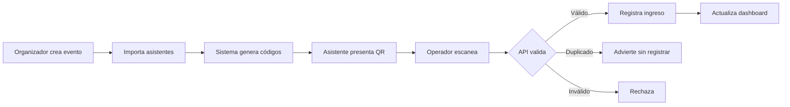

# Alcance del MVP

## 1. Usuarios objetivo

- **Administrador:** configura la plataforma y permisos.
- **Organizador:** crea eventos y gestiona asistentes.
- **Operador de check-in:** valida códigos y registra ingresos.
- **Asistente:** recibe y presenta su código QR.

## 2. Incluido

### Eventos

- crear, consultar y editar un evento;
- definir nombre, fechas, ubicación, zona horaria y estado;
- activar o cerrar el check-in.

### Asistentes e inscripciones

- registrar asistentes manualmente;
- importar asistentes mediante CSV validado;
- buscar por nombre, correo o código;
- asociar una persona con un evento mediante una inscripción;
- exportar una lista operativa básica.

### QR y check-in

- generar un código opaco y único por inscripción;
- representar el código como QR;
- ingresar el código manualmente o escanearlo con la cámara;
- registrar el primer ingreso válido;
- impedir duplicados por defecto;
- mostrar mensajes claros para código aceptado, duplicado o inválido;
- registrar operador, fecha y hora.

### Operación

- dashboard con registrados, ingresaron y pendientes;
- últimos ingresos;
- endpoint de salud;
- logs, métricas y trazabilidad básica;
- autenticación y roles del personal;
- despliegue automatizado a un ambiente de desarrollo y uno de producción.

## 3. Fuera del MVP

- venta de entradas y pagos;
- agenda, sesiones, speakers y control de aforo por sala;
- captura y calificación de leads de sponsors;
- aplicación móvil nativa;
- marketplace o plataforma multi-tenant comercial;
- credenciales físicas e impresión profesional;
- recomendaciones con inteligencia artificial;
- microservicios, Kubernetes y arquitectura multi-región;
- sincronización offline completa entre múltiples dispositivos;
- integraciones con CRM o plataformas de mailing.

## 4. Pospuesto para evolución

- reingresos configurables;
- modo contingencia offline;
- envío de QR por correo;
- acreditación por sesiones;
- portal de autoservicio del asistente;
- multi-tenant;
- analítica avanzada;
- captura de leads de sponsors.

## 5. Reglas de negocio principales

1. Un evento tiene cero o más inscripciones.
2. Una inscripción pertenece exactamente a un evento y un asistente.
3. Un código QR identifica una inscripción sin incluir datos personales legibles.
4. Un código inactivo, inexistente o perteneciente a otro evento no permite el ingreso.
5. El primer check-in válido se registra de forma atómica.
6. Un segundo intento devuelve `duplicate` y no crea otro registro, salvo futura política de reingreso.
7. Solo personal autorizado puede ejecutar check-in o consultar datos personales.
8. Toda acción sensible debe ser auditable.

## 6. Recorrido crítico

## 7. Definition of Done global

Una historia está terminada cuando:

- cumple criterios de aceptación;
- incluye pruebas proporcionales al riesgo;
- pasa lint, typecheck, test y build;
- no contiene secretos ni vulnerabilidades críticas conocidas;
- actualiza documentación relevante;
- fue integrada mediante Pull Request con CI verde;
- puede demostrarse en el ambiente previsto.

