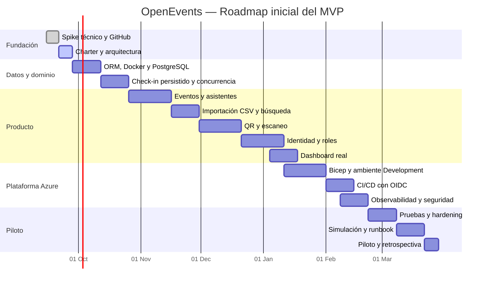

# Roadmap y Gantt

El roadmap considera una capacidad inicial de aproximadamente 5–7 horas por semana. Las fechas son objetivos y se revisarán cada semana.

## Fases

| Fase | Fechas objetivo | Resultado |
|---|---|---|
| Iteración 0 | 15–27 sep 2026 | Stack, repositorio, CI y arquitectura baseline |
| Fundación de datos | 28 sep–25 oct 2026 | PostgreSQL, migraciones y check-in persistido |
| Gestión de eventos/asistentes | 26 oct–29 nov 2026 | CRUD esencial, CSV y búsquedas |
| Identidad y QR | 30 nov 2026–10 ene 2027 | Roles, autenticación y QR operativo |
| Azure y operación | 11 ene–21 feb 2027 | IaC, ambientes, CI/CD y observabilidad |
| Piloto | 22 feb–28 mar 2027 | Pruebas, runbook, simulación y retroalimentación |

## Gantt

## Hitos

| Hito | Evidencia |
|---|---|
| H0 — Baseline aprobada | Documentación y ADR en `main` |
| H1 — Persistencia real | Reiniciar API no pierde check-ins |
| H2 — Recorrido de organizador | Evento e inscripciones gestionables |
| H3 — Recorrido de puerta | QR real, cámara y prevención de duplicados |
| H4 — Desarrollo en Azure | URL de Development y CI/CD automático |
| H5 — Release candidate | Pruebas, seguridad, monitoreo y runbook |
| H6 — Piloto | Evidencia operativa y retrospectiva |

## Regla de ajuste

Si una fase se retrasa, se reduce alcance `Should` antes de ampliar horas o añadir complejidad. Las funciones fuera del MVP no desplazan requisitos `Must`.

